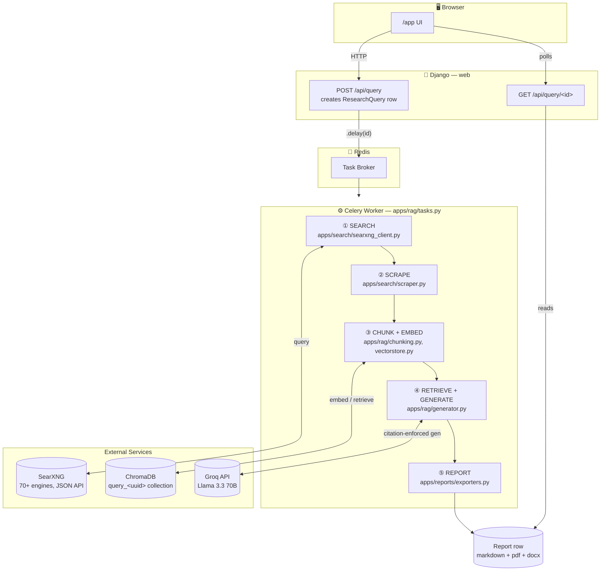
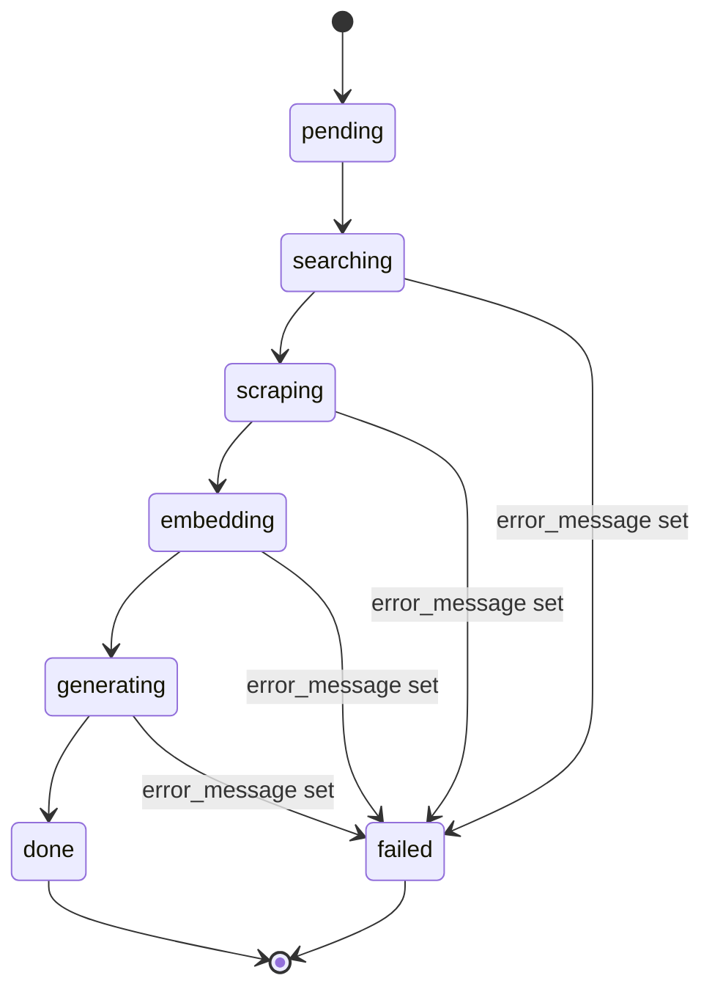
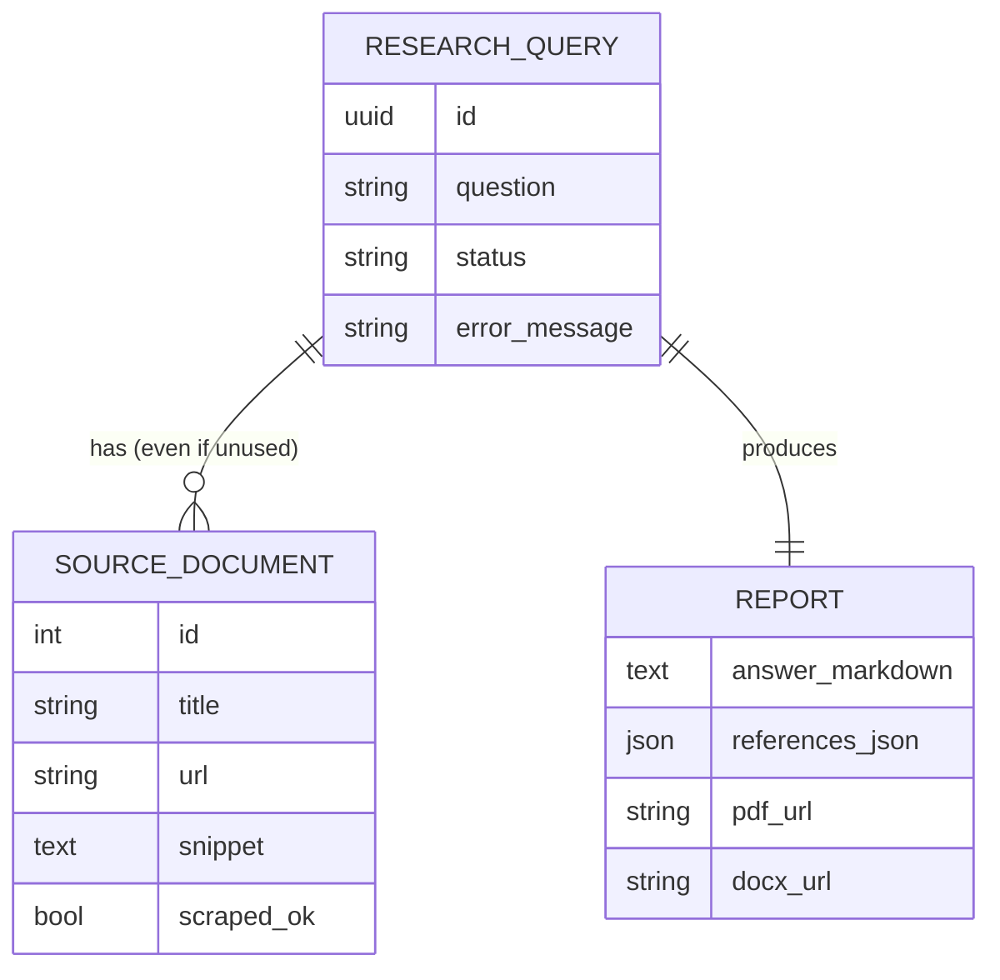

# Research Forge AI

**Ask a question. Get back a report — every claim traceable to a real source, none of it hallucinated.**

Research Forge AI is a self-hosted research pipeline: it fans your question out across 70+ search engines, scrapes and cleans the results, retrieves the most relevant passages, and forces the LLM to answer *only* from what it retrieved — citing `[n]` back to a numbered source for every sentence. No answer ships without a receipt.

```
question ─▶ SearXNG (search) ─▶ trafilatura (clean text) ─▶ ChromaDB (retrieve)
         ─▶ Groq / Llama (citation-enforced answer) ─▶ Markdown / PDF / DOCX
```

Everything runs on infrastructure you own — no paid search API, no paid embedding API, no vendor lock-in on the LLM. Django serves the API, Celery runs the pipeline in the background, and the whole thing ships as one Docker Compose stack.

<p>
  
  
  
  
  
  
  
  
  
  
  
</p>
<p>
  
  
  
  
</p>

---

## Screenshots

> Images live in [`docs/screenshots/`](docs/screenshots) and are referenced by relative path — this is more reliable than pasted `user-attachments` links, which expire or 404 if the paste happens before the upload finishes. Save each screenshot with the filename shown below.

**Landing page**

| Home | Workflow | What it does |
|---|---|---|
|  |  |  |

**Research Ledger (the tool)**

| User query | Fetching sources | Cited answer | PDF export |
|---|---|---|---|
|  |  |  |  |

---

## What this is

You ask a question. The system:

1. Fans the question out across 70+ search engines via a self-hosted SearXNG instance (no search API key, no per-query cost)
2. Scrapes and cleans the top results into plain readable text
3. Chunks and embeds that text into a vector store, scoped to this one question
4. Retrieves the most relevant chunks and asks an LLM to answer — but only using those chunks, with every claim tagged `[n]` back to a numbered source
5. Packages the cited answer into a Markdown report, and exports it to PDF and DOCX on request

Nothing is stated in the final answer without a reference the reader can click through to. That's the whole point of the project.

---

## Architecture



### Pipeline status flow



### Data model



Each `ResearchQuery` also owns its own **ChromaDB collection** (`query_<uuid>`), created and torn down independently — retrieval for one question never touches another question's context.

---

## Tech stack

| Layer | Technology | Why |
|---|---|---|
| Web framework | Django 5 + Django REST Framework | Models, admin, and a REST API in one place |
| Task queue | Celery 5 + Redis | The pipeline is slow (network + LLM calls) — never block a request |
| Meta-search | SearXNG (self-hosted, Docker) | Aggregates 70+ engines, zero API cost, no rate-limited search key |
| Scraping | trafilatura | Strips boilerplate/nav/ads better than raw BeautifulSoup for article text |
| Embeddings | sentence-transformers (`all-MiniLM-L6-v2`) | Runs locally, no embedding API cost |
| Vector store | ChromaDB (persistent, local) | Simplest embedded vector DB for a single-node deployment |
| Generation | Groq API (Llama 3.3 70B) | Free tier, OpenAI-compatible, fast inference |
| Export | markdown, xhtml2pdf, python-docx | Pure-Python — no system-level GTK/Cairo dependencies |
| Frontend | Vanilla HTML/CSS/JS (no build step) | Two Django templates (`home.html`, `tool.html`), no npm toolchain to maintain |

---

## Project structure

```
ai-research-assistant/
├── docker-compose.yml        # searxng + redis + web + celery_worker
├── Dockerfile
├── requirements.txt
├── .env.example
├── searxng-config/
│   └── settings.yml           # enables SearXNG's JSON API (off by default)
├── docs/
│   └── screenshots/           # drop screenshots here (see its own README)
├── config/                    # Django project settings, urls, celery app
├── apps/
│   ├── search/                 # ① ② — ResearchQuery/SourceDocument models,
│   │                            SearXNG client, trafilatura scraper
│   ├── rag/                    # ③ ④ — chunking, ChromaDB vector store,
│   │                            citation-enforcing generator, Celery pipeline
│   ├── reports/                 # ⑤ — Report model, Markdown → PDF/DOCX exporters
│   └── api/                     # DRF views + urls, home.html + tool.html views
└── templates/
    ├── home.html                # landing page: pitch, workflow diagram, features
    └── tool.html                 # the actual Research Ledger UI
```

---

## Setup (local development)

### Prerequisites
- Python 3.11+
- Docker (for SearXNG + Redis — not worth installing bare-metal)
- A free [Groq API key](https://console.groq.com/keys)

### 1. Virtual environment

```bash
python -m venv .venv
# Windows:
.venv\Scripts\activate
# macOS/Linux:
source .venv/bin/activate

pip install --upgrade pip
pip install -r requirements.txt
```

### 2. SearXNG + Redis

```bash
docker run -d -p 8080:8080 -v "$(pwd)/searxng-config:/etc/searxng" --name searxng searxng/searxng
docker run -d -p 6379:6379 --name research_redis redis:7-alpine
```

### 3. Environment variables

```bash
cp .env.example .env
```

```env
DJANGO_SECRET_KEY=change-this-to-a-random-string
DEBUG=1
SEARXNG_URL=http://localhost:8080
REDIS_URL=redis://localhost:6379/0
GROQ_API_KEY=gsk_your-real-key-here
LLM_MODEL=llama-3.3-70b-versatile
```

### 4. Database

```bash
python manage.py makemigrations search reports
python manage.py migrate
```

### 5. Run it (two processes)

```bash
# terminal 1
python manage.py runserver

# terminal 2 — Windows needs --pool=solo, Celery's default pool doesn't work there
celery -A config worker -l info --pool=solo
```

Visit `http://localhost:8000/` for the landing page, or `http://localhost:8000/app` to go straight to the tool.

---

## API reference

### `POST /api/query`
Kick off a research run.

```json
// Request
{ "question": "What are the latest developments in small modular reactors?" }
```
```json
// Response — 202 Accepted
{ "id": "b3f1c2a4-...", "status": "pending" }
```

### `GET /api/query/<uuid>`
Poll status / fetch the finished report.

```json
{
  "id": "b3f1c2a4-...",
  "status": "done",
  "error_message": "",
  "sources": [
    { "id": 1, "title": "...", "url": "...", "snippet": "...", "scraped_ok": true }
  ],
  "report": {
    "answer_markdown": "...",
    "references_json": [
      { "index": 1, "title": "IAEA SMR Overview", "url": "https://..." }
    ],
    "pdf_url": "http://localhost:8000/media/reports/pdf/b3f1c2a4-....pdf",
    "docx_url": "http://localhost:8000/media/reports/docx/b3f1c2a4-....docx"
  }
}
```

`status` progresses: `pending → searching → scraping → embedding → generating → done`, or `failed` with `error_message` populated.

---

## Tuning

All in `config/settings.py`:

| Setting | Default | Effect |
|---|---|---|
| `TOP_K_RESULTS` | `8` | Search results scraped per query |
| `TOP_K_CHUNKS` | `6` | Chunks fed to the LLM per answer |
| `CHUNK_SIZE` / `CHUNK_OVERLAP` | `800` / `150` | Retrieval granularity (characters) |
| `EMBEDDING_MODEL` | `all-MiniLM-L6-v2` | Swap for a larger sentence-transformer for higher recall |
| `LLM_MODEL` | `llama-3.3-70b-versatile` | Any Groq-hosted model; swap providers entirely in `apps/rag/generator.py` |

---

## Design notes

- **Per-query vector isolation.** Each `ResearchQuery` gets its own Chroma collection — no cross-contamination between unrelated research sessions. Trade-off: no shared knowledge base/caching across queries.
- **Citation enforcement is two-layered.** The LLM is prompted to cite every claim with `[n]`; `apps/rag/generator.py` then strips any reference the model didn't actually cite from the final list.
- **Graceful scrape failures.** If `trafilatura` can't extract a page (paywall, heavy JS), the pipeline falls back to the SearXNG snippet instead of dropping the source.
- **No system-level PDF dependencies.** `xhtml2pdf` was chosen over WeasyPrint specifically because it needs no GTK/Cairo/Pango install — works out of the box on Windows.
- **SQLite by default.** Fine for local dev and single-node deployments; switch `DATABASES` in `config/settings.py` to Postgres for anything multi-user.

---

## Deployment

See the deployment guide below (or ask your assistant to walk through it) —
in short: this app is four services (`searxng`, `redis`, Django, Celery worker),
which maps cleanly onto a single Docker Compose stack on any VPS, or split
across a PaaS (Django on Render/Railway, Redis add-on, SearXNG as its own
Docker service, Celery as a background worker dyno).

---

## License

MIT — do whatever you want with it.
